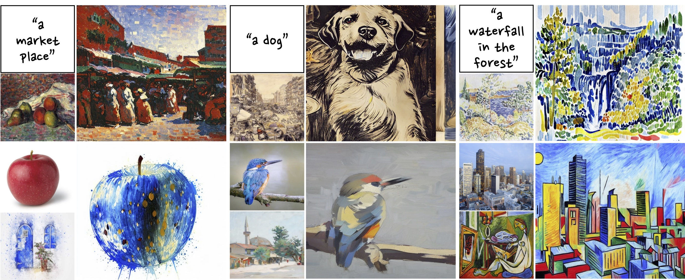

## DreamStyler: Paint by Style Inversion with Text-to-Image Diffusion Models

[[**arXiv**](https://arxiv.org/abs/2309.06933)] [[**Project Page**](https://nmhkahn.github.io/dreamstyler)]

[Namhyuk Ahn](https://nmhkahn.github.io)<sup>1</sup>, [Junsoo Lee](https://ssuhan.github.io/)<sup>1</sup>, [Chunggi Lee](https://chungyi347.github.io)<sup>1,2</sup>, [Kunhee Kim](https://kunheekim.xyz/)<sup>3</sup>, [Daesik Kim](https://scholar.google.com/citations?user=YUcWWbEAAAAJ)<sup>1</sup>, [Seung-Hun Nam](https://scholar.google.com/citations?user=QIjkOgEAAAAJ)<sup>1</sup>, [Kibeom Hong](https://scholar.google.com/citations?user=-imqSqoAAAAJ)<sup>4†</sup> <br>
NAVER WEBTOON AI<sup>1</sup>,  Harvard University<sup>2</sup>, KAIST<sup>3</sup>, SwatchOn<sup>4</sup> <br>
Corresponding author<sup>†</sup><br>
AAAI 2024



### Abstract
Recent progresses in large-scale text-to-image models have yielded remarkable accomplishments, finding various applications in art domain.
However, expressing unique characteristics of an artwork (*e.g.* brushwork, colortone, or composition) with text prompts alone may encounter limitations due to the inherent constraints of verbal description.
To this end, we introduce **DreamStyler**, a novel framework designed for artistic image synthesis, proficient in both text-to-image synthesis and style transfer.
DreamStyler optimizes a multi-stage textual embedding with a context-aware text prompt, resulting in prominent image quality.
In addition, with content and style guidance, DreamStyler exhibits flexibility to accommodate a range of style references.
Experimental results demonstrate its superior performance across multiple scenarios, suggesting its promising potential in artistic product creation.

## Training
```shell
accelerate launch dreamstyler/train.py \
  --num_stages 6 \
  --train_image_path "./images/03.png" \
  --context_prompt "A painting of pencil, pears and apples on a cloth, in the style of {}" \
  --placeholder_token "<sks03>" \
  --output_dir "./outputs/sks03" \
  --learnable_property style \
  --initializer_token painting \
  --pretrained_model_name_or_path "runwayml/stable-diffusion-v1-5" \
  --resolution 512 \
  --train_batch_size 8 \
  --gradient_accumulation_steps 1 \
  --max_train_steps 500 \
  --save_steps 100 \
  --learning_rate 0.002 \
  --lr_scheduler constant \
  --lr_warmup_steps 0
```
We ran training using A100 so if your GPU is not enough memory, please reduce `--batch_size` and increase `--max_train_steps` appropritately, or increase `--gradeint_accumulation_steps`.

The `--train_image_path` is the image path to mimic and the style and you should provide `--context_prompt` to enhance the personalization performance. You may refer `./images/prompt_blip2.txt` or `./images/prompt_hf.txt` to check examples of context prompt of images in `./images` directory. The prompts in the `prompt_blip2.txt` are automatically extracted by BLIP-2 and the prompts in the `prompt_hf.txt` are the enhanced version by the human feedback (further annotation).


## Inference
#### Text-to-image synthesis
```shell
python dreamstyler/inference_t2i.py \
  --sd_path "runwayml/stable-diffusion-v1-5" \
  --embedding_path ./outputs/sks03/embedding/final.bin \
  --prompt "A painting of a lighthight next to cliff in the style of {}" \
  --saveroot ./outputs/sample03 \
  --placeholder_token "<sks03>"
```

#### Style transfer
```shell
python dreamstyler/inference_style_transfer.py \
  --sd_path "runwayml/stable-diffusion-v1-5" \
  --embedding_path ./outputs/sks03/embedding/final.bin \
  --content_image_path ./images/content.png \
  --saveroot ./outputs/sample03 \
  --placeholder_token "<sks03>"
```


## Citation
```
@article{ahn2023dreamstyler,
  title={DreamStyler: Paint by Style Inversion with Text-to-Image Diffusion Models}, 
  author={Ahn, Namhyuk and Lee, Junsoo and Lee, Chunggi and Kim, Kunhee and Kim, Daesik and Nam, Seung-Hun and Hong, Kibeom},
  journal={arXiv preprint arXiv:2309.06933},
  year={2023},
}
```

## License
```
DreamStyler
Copyright 2024-present NAVER WEBTOON

Licensed under the Apache License, Version 2.0 (the "License");
you may not use this file except in compliance with the License.
You may obtain a copy of the License at

    http://www.apache.org/licenses/LICENSE-2.0

Unless required by applicable law or agreed to in writing, software
distributed under the License is distributed on an "AS IS" BASIS,
WITHOUT WARRANTIES OR CONDITIONS OF ANY KIND, either express or implied.
See the License for the specific language governing permissions and
limitations under the License.
```
